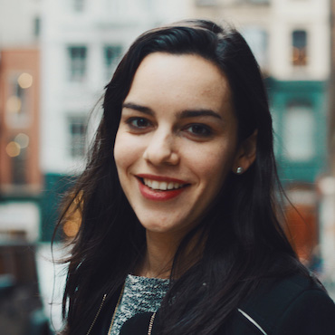
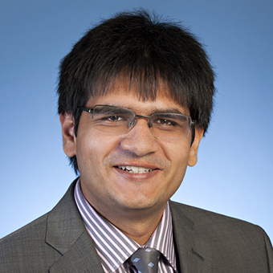
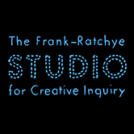

# About our Team and Sponsors

--- 

### Contact Us

*We welcome feedback of any kind. Please feel free to get in touch with us via email at [contact@terrapattern.com](mailto:contact@terrapattern.com).*

### Credits

[**Terrapattern**](http://www.terrapattern.com/) was created by [Golan Levin](http://flong.com/), [David Newbury](http://www.workergnome.com/), and [Kyle McDonald](http://kylemcdonald.net/) with the assistance of [Irene Alvarado](http://www.irenealvarado.com/), [Aman Tiwari](http://amantiwari.com/), and [Manzil Zaheer](http://manzil.ml/). The project was developed at the CMU [Frank-Ratchye STUDIO for Creative Inquiry](http://studioforcreativeinquiry.org/) with support from the [John S. and James L. Knight Foundation](http://www.knightfoundation.org/).

---

# Golan Levin

Terrapattern project director, [**Golan Levin**](http://flong.com/) ([@golan](https://twitter.com/golan)) is Associate Professor of Computation Arts at Carnegie Mellon University, where he also holds courtesy appointments in Computer Science, Entertainment Technology, Architecture, and Design. Since 2009 he has served as Director of the [Frank-Ratchye STUDIO for Creative Inquiry](http://studioforcreativeinquiry.org), a laboratory for atypical and anti-disciplinary research across the arts, science, technology and culture. A two-time TED speaker and recipient of undergraduate and graduate degrees from the MIT Media Laboratory, Golan was recently named one of "50 Designers Shaping the Future" by Fast Company. Through digital artifacts, online tools, and virtual environments, often created with a variety of collaborators, Levin applies creative twists to digital technologies that highlight our relationship with machines, reveal hidden aspects of communication, and new intersections of machine code and visual culture.

---

# David Newbury

[**David Newbury**](http://www.workergnome.com/) ([@workergnome](https://twitter.com/workergnome)) is a creative developer working at the intersections between hardware, animation and data. He explores methods of using technology to provide novel experiences without obvious technological mediation. He has spent the past 15 years working on interactive projects for major brands, including Samsung, Google, and Oreo, as well as working with museums, universities and public broadcasting. His work has received national attention, including Emmy awards and coverage in *Wired*, *Vice*, and other publications. He runs a small design practice, Workergnome Studios, focusing on unusual development projects, and he gives workshops on using technology for artistic practices.

---

# Kyle McDonald

[**Kyle McDonald**](http://kylemcdonald.net/) ([@kcimc](https://twitter.com/kcimc)) is an artist who works in the open with code. He is a contributor to arts-engineering toolkits like openFrameworks, and spends a significant amount of time building tools that allow artists to use new algorithms in creative ways. He enjoys creatively subverting networked communication and computation, exploring glitch and embedded biases, and extending these concepts to the reversal of everything from personal identity to work habits. Kyle is an adjunct professor at NYU's ITP, and was formerly a member of F.A.T. Lab, community manager for openFrameworks, and artist in residence at the Frank-Ratchye STUDIO for Creative Inquiry at Carnegie Mellon. He frequently leads workshops exploring computer vision and interaction.

--- 

# Irene Alvarado

[**Irene Alvarado**](http://www.irenealvarado.com/) ([@ire_alva](https://twitter.com/ire_alva)) is a designer and creative coder based in Pittsburgh and NYC. Originally from Caracas, Venezuela, she graduated from Columbia University with a dual degree in history and computer science, and after college joined a small passionate team at a tech think tank helping some of the world's largest companies develop technology strategies. Irene is presently working towards a Master of Science in Emerging Media and Human Computer Interaction at Carnegie Mellon University. She uses a combination of technical expertise and design thinking to investigate the digital threads that connect computation, visualization, and storytelling.

---

# Aman Tiwari

[**Aman Tiwari**](http://amantiwari.com/) ([@aman_gif](https://twitter.com/aman_gif)) is an undergraduate at Carnegie Mellon University, studying towards a hybrid degree in Computer Science and Art. Aman writes, "I care about new media art and how it interacts with the world. I care about how the world is directed by what we do. I care about how tech changes and is changed by the world. I care about the internet. I believe in technology giving us the power to think unthinkable thoughts. I care about making. I care about consuming." In summer 2016, Aman will be an intern at Google, assisting research on image processing and machine learning. 

---

# Manzil Zaheer 

[**Manzil Zaheer**](http://manzil.ml/) is a doctoral student in the Machine Learning Department at Carnegie Mellon University. His research is concerned with harnessing theoretical techniques from varied disciplines to solve practical problems; he particularly enjoys finding simple ways to implement statistical inference and data-parallel programming algorithms. Currently Manzil is studying nonparametric Bayesian methods, scalable machine learning, fast sampling techniques, random graph generative models and applications of machine learning to VLSI CAD.

---

#The Frank-Ratchye STUDIO for Creative Inquiry

The *Terrapattern* project was developed at the [**Frank-Ratchye STUDIO for Creative Inquiry**](http://studioforcreativeinquiry.org/) ([@creativeinquiry](twitter.com/creativeinquiry)), a flexible laboratory dedicated to the support of atypical, anti-disciplinary and inter-institutional research at the intersection of the arts, science, technology and culture. Founded in 1989 within the [College of Fine Arts](http://www.cfa.cmu.edu/) at [Carnegie Mellon University](http://www.cmu.edu/), the STUDIO serves as a locus for hybrid enterprises on the CMU campus, the Pittsburgh region, and internationally. The STUDIO's current emphasis on new media arts builds on more than two decades of experience hosting interdisciplinary artists in an environment enriched by world-class science and engineering departments. Through our programs, the STUDIO provides opportunities for learning, dialogue and research that lead to innovative breakthroughs, new policies, and the redefinition of the role of artists in a quickly changing world.

--- 
#Acknowledgments 

**Terrapattern was made possible through a Media Innovation [Prototype Fund](http://www.knightfoundation.org/grants/201551228/) grant from the [John S. and James L. Knight Foundation](http://www.knightfoundation.org/), which supports transformational ideas that promote quality journalism, advance media innovation, engage communities and foster the arts. The Knight Foundation believes that democracy thrives when people and communities are informed and engaged.**

---

*Professor Levin and the Terrapattern team gratefully acknowledge the following individuals and organizations for their support and encouragement:*

We express our gratitude to [**Knight Foundation**](http://www.knightfoundation.org/), and in particular [Chris Barr](http://www.knightfoundation.org/staff/chris-barr/), Director of the Media Innovation program and manager of the Knight Prototype Fund, and [Eva Pereira](http://www.knightfoundation.org/staff/eva-pereira/), Media Innovation Associate, for their advocacy, support, and patient cultivation of our investigation.

Members of the Carnegie Mellon University [**CREATE Lab**](http://cmucreatelab.org/) provided essential advice and guidance in performing large-scale computations on satellite imagery for humanitarian purposes. We are especially grateful to [Randy Sargent](http://www.ri.cmu.edu/person.html?type=newsmedia&person_id=2434), Paul Dille, and Professor Illah Nourbakhsh of the CREATE Lab. 

The leadership team of [**DataKind**](http://www.datakind.org/), which works to harness the power of data science in the service of humanity, provided crucial early encouragement of this investigation. We express our gratitude to [Jake Porway](http://www.datakind.org/our-team), Founder and Executive Director, and [Erin Akred](http://www.datakind.org/our-team), Chief Data Scientist and Head of DataKind Labs, for their interest and support. 

Our colleagues in the CMU [**Machine Learning Department**](http://www.ml.cmu.edu/) (MLD) provided key technical advice and support. In particular, our project uses an implementation of [*Cover Trees*](https://github.com/manzilzaheer/CoverTree), developed by Manzil Zaheer in the MLD, for fast, asynchronous nearest neighbor search. This implementation made it possible for our project to function in real-time. We thank Manzil and his professors [Alex Smola](http://alex.smola.org/), David Andersen, and Ruslan Salakhutdinov for their kind support in making this possible.

We thank the organizers of the [**Alt-AI**](http://alt-ai.net/) conference, [Gene Kogan](http://www.genekogan.com/) and Lauren Gardner, and the directors of the [**SFPC**](http://sfpc.io/) (School for Poetic Computation), [Taeyoon Choi](http://sfpc.io/people/taeyoon-choi/) and [Zachary Lieberman](http://sfpc.io/people/zach-lieberman/), for kindly inviting the *Terrapattern* project to premiere in an [exhibition](http://alt-ai.net/#exhibition) at this unique conference event. 

Last, but not least, we acknowledge the support of our hardworking staff and students at the [**Frank-Ratchye STUDIO for Creative Inquiry**](studioforcreativeinquiry.org), including Tom Hughes, Linda Hager, [Dan Moore](makeitdoathing.com), Aprameya Mysore, and [Charlotte Stiles](http://charlottestiles.com/).